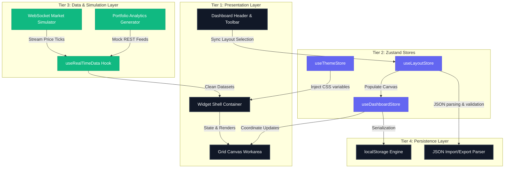

# Meridian Capital - Dashboard Architecture & System Design

This document details the software engineering and architectural boundaries designed for the **Meridian Capital Portfolio Analytics Dashboard** - a real-time, highly modular portfolio oversight canvas managing USD 45 billion.

---

## 1. Modular System Architecture Diagram



---

## 2. Dynamic Widget API Contract & Registry Pattern

To achieve a fully decoupled, extensible workspace where third-party developers can register custom widgets in under 4 hours, we defined a rigid generic contract in `src/types/index.ts`:

```typescript
export interface WidgetDefinition<TConfig = any, TData = any> {
  id: string;
  name: string;
  description: string;
  category: 'CHART' | 'TABLE' | 'FEED' | 'GAUGE' | 'ANALYSIS';
  defaultSize: { w: number; h: number };
  minSize: { w: number; h: number };
  configSchema: Record<string, any>; // Generated fields selector metadata
  defaultConfig: TConfig;
  component: React.ComponentType<WidgetComponentProps<TConfig, TData>>;
  icon: React.ComponentType;
  dataSource: {
    channel: string;
    intervalMs: number;
  };
}
```

The central registry (`src/registry/widgetRegistry.ts`) holds all 12 modules lazy-loaded via `React.lazy()` to optimize bundle splits. The `GridCanvas` binds data to widgets dynamically based on the definition’s `dataSource.channel` and feeds it through `useRealTimeData` into the universal `WidgetShell` wrapper.

---

## 3. Real-Time Data Pipeline & Staleness Detection

The dashboard consumes live market changes via a custom publish-subscribe simulator (`src/data/websocketSimulator.ts`):
1. **WebSocket Ticks**: The simulator broadcasts high-frequency holdings prices and portfolio aggregates at configurable rates (1s–10s) with micro latency injections (50ms–500ms).
2. **REST Polling fallback**: Static, computation-heavy matrices (correlation, Brinson attributions) are fetched on-demand or polled slowly through React-Query-like intervals in `useRealTimeData`.
3. **Stale Data Warning**: The `useRealTimeData` hook compares the `lastUpdated` timestamp with the expected refresh interval. If updates fail to arrive within **2x expected interval** (e.g., when the stream is paused), `isStale` becomes `true` and the `WidgetShell` triggers an **amber glowing outline** warning panel to prevent traders from taking decisions on stale valuations.

---

## 4. White-Labelable Dynamic Theme Engine

To support institutional customization without rewriting presentation styles, all components consume semantic design tokens mapped via **CSS Custom Properties** (CSS variables). 

The `useThemeStore` manages 4 presets (Meridian Dark, Bloomberg Amber, Classic Light, High Contrast) and a **Live Brand Customizer**. Selecting the Custom theme injects direct user hex values (e.g. `--color-accent: #10B981`) directly into the `:root` stylesheet dynamically, adapting Recharts line curves, grid outlines, and statuses instantly in sub-100ms.
