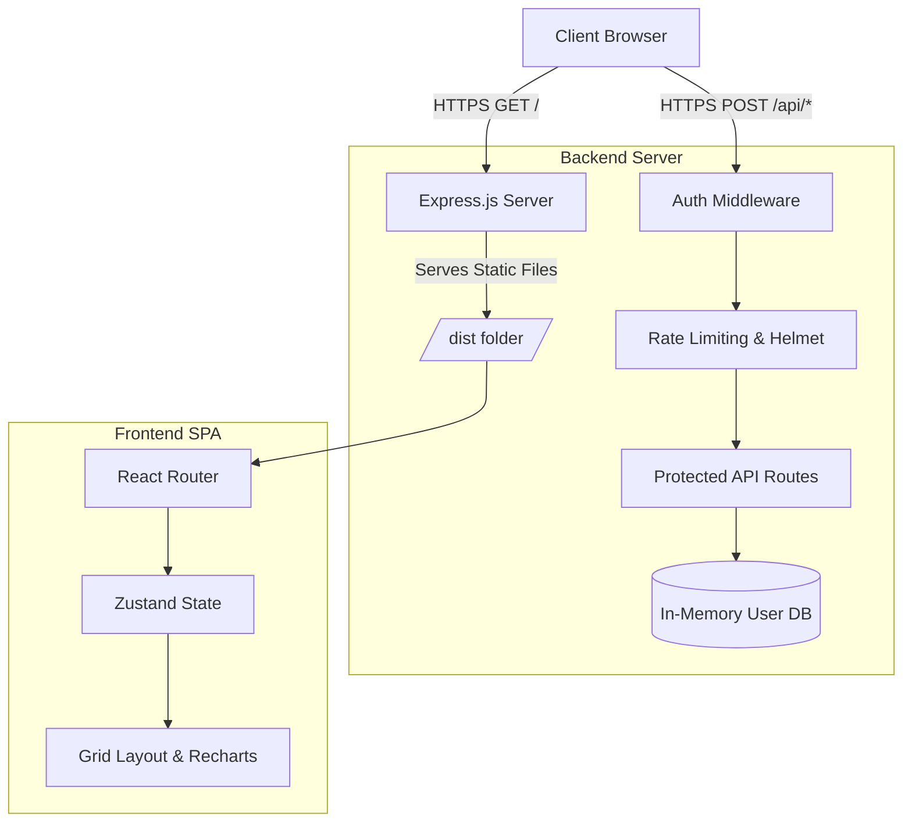

# Meridian Capital Dashboard

  

A high-performance, real-time institutional financial dashboard and secure Single Sign-On (SSO) portal built for rapid data visualization and secure portfolio management.

## 📌 Problem Understanding & Scope
Institutional analysts require low-latency, highly customizable interfaces to monitor portfolios, assess risk, and track market movements without refreshing pages or navigating clunky multi-page applications. 

**Meridian Dashboard** solves this by providing a unified, spatial drag-and-drop workspace powered by an automated, simulated WebSockets stream and secured by enterprise-grade backend protections.

## 🏗 System Architecture

This project is built as a **Unified Monorepo**, where a single Node.js/Express backend serves both the secure API routes and the statically built React SPA, eliminating cross-origin (CORS) complexities in production.



## ✨ Key Features & Solution Quality

1. **Enterprise SSO & Security**
   - Built-in Mock OTP Email Recovery system.
   - Passwords cryptographically hashed using `bcryptjs`.
   - Global rate limiting, Helmet HTTP headers, and HTTP Parameter Pollution (HPP) protection.
2. **Spatial UI (Drag-and-Drop)**
   - Powered by `react-grid-layout`, allowing users to construct their own bespoke terminal views.
3. **Real-Time Data Simulation**
   - Simulated `WebSocket` layer delivering sub-second market latency, dynamic PnL updates, and live news feeds.
4. **Cinematic Theming Engine**
   - Global CSS-variable injected theming (Meridian Dark, Classic Light, Bloomberg Terminal).
   - Premium glassmorphism aesthetics and custom magnetic cursors using `framer-motion`.

## 🛠 Technology Stack

- **Frontend**: React 18, TypeScript, Vite, Tailwind CSS, Framer Motion, Recharts, Zustand.
- **Backend**: Node.js, Express 5, `express-rate-limit`, `helmet`, `bcryptjs`.
- **Infrastructure**: Render `render.yaml` Infrastructure-as-Code.

## 🚀 Installation & Local Development

### Prerequisites
- Node.js v20+
- npm or yarn

### Setup Instructions

1. **Clone the repository**
   ```bash
   git clone https://github.com/tannu005/meridian-dashboard.git
   cd meridian-dashboard
   ```

2. **Install all dependencies**
   ```bash
   npm install
   ```

3. **Configure Environment**
   Copy the example environment file:
   ```bash
   cp .env.example .env
   ```

4. **Run the Development Environment**
   This command starts both the Vite hot-reloading frontend and the Express backend concurrently:
   ```bash
   npm run start
   ```

## 🌍 Production Deployment

This repository is configured for 1-click cloud deployment via Render.
The `render.yaml` blueprint handles the build and boot process automatically.

1. Connect the repository to Render as a **Blueprint**.
2. Render executes: `npm install --include=dev && npm run build`
3. Render starts the server: `npm run start`

## 🛡 Industry Best Practices Adopted

- **Strict TypeScript**: Type interfaces are rigorously enforced for all financial data models to prevent runtime regressions.
- **Environment Isolation**: `.env` configuration ensures secrets are not leaked into source control.
- **Security-First Architecture**: Implemented robust Express middlewares to defend against OWASP Top 10 vulnerabilities (XSS, brute force, parameter pollution).
- **Performant Build Tools**: Leveraged Vite and Rollup for optimal tree-shaking and minified production bundles.
